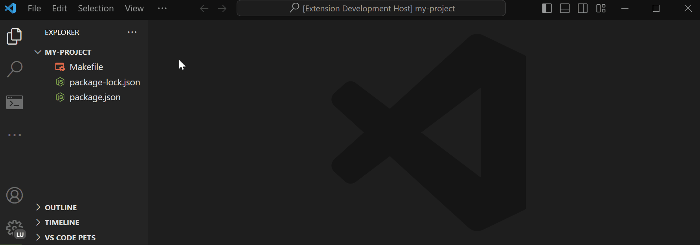
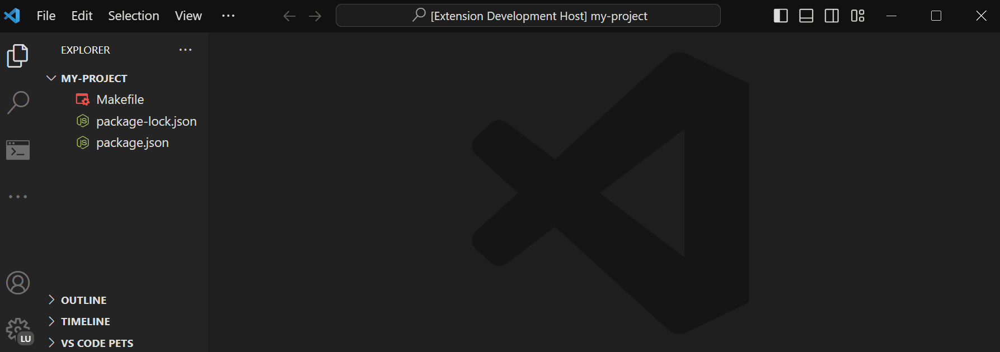

# ClickScript

This extension is a tool that provides you a list of scripts from your project's package.json and Makefile. You can then click on a script to execute it automaticaly in a new terminal.

## Features

### Sidebar

Once you have installed ClickScript and opened a project, you will see a new icon in the activity bar. clicking on this icon will display a new sidebar with the list of scripts that come from your package.json and Makefile. You can click on one of them to execute the script of your choice.

### Command

ClickScript also allows you to execute your scripts from the command palette. Open it by pressing `Ctrl+Shift+P` or `Cmd+Shift+P` on Mac.

If you want to execute a script from **package.json**, type the command `execute script` and select the script to run from the list.

---

If you want to execute a script from **Makefile**, type the command `execute make` and select the script to run from the list.

## Contributing

If you want to contribute to this project, read [this guide](CONTRIBUTING.md).
